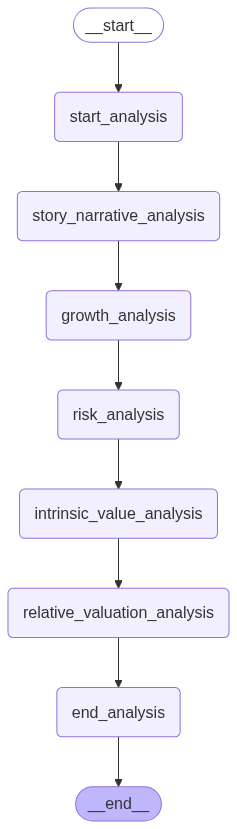

# Financial Agents


A collection of AI-powered financial analysis agents inspired by legendary investors and trading strategies. This project provides a framework for conducting comprehensive financial analysis using specialized agents, each implementing the investment philosophy of a different renowned investor or trading approach.

## Installation and Running

### Prerequisites

- Python >= 3.10
- uv (for dependency management)

### Installation

```bash
# Clone the repository
git clone https://github.com/aostock/financial-agents
cd financial-agents

# Install dependencies
uv sync

# Activate the virtual environment
source .venv/bin/activate
```

### Running the Application

```bash
# Start the development server
langgraph dev --allow-blocking --debug-port 5678
```

Alternatively, you can run the FastAPI server directly:

```bash
# Run the FastAPI server
python main.py
```

The server will start on port 2024 by default (configurable via PORT environment variable).

## Frontend UI

The frontend UI for this project is available at: [agent-chat-ui](https://github.com/aostock/agent-chat-ui)

## Data Sources

Financial data for this project is sourced from: [financial-data](https://github.com/aostock/financial-data)

## Agent Overview

This project includes multiple specialized financial analysis agents, each implementing the investment philosophy and methodology of a different renowned investor or trading approach.

### Available Agents

#### 1. Warren Buffett Agent


Implements Warren Buffett's value investing philosophy:

- Focus on businesses within his "circle of competence"
- Evaluate economic moats and competitive advantages
- Assess management quality and capital allocation skills
- Analyze financial strength and consistency
- Calculate intrinsic value and margin of safety

#### 2. Charlie Munger Agent


Applies Charlie Munger's multidisciplinary approach:

- Evaluate management quality and integrity
- Assess moat strength and durability
- Analyze business predictability
- Determine fair valuation

#### 3. Benjamin Graham Agent


Follows Benjamin Graham's value investing principles:

- Analyze earnings stability
- Evaluate financial strength
- Determine intrinsic valuation

#### 4. Peter Lynch Agent


Implements Peter Lynch's growth investing approach:

- Understand the business and its story
- Evaluate earnings quality
- Conduct fundamental analysis
- Analyze growth prospects
- Determine intrinsic value

#### 5. Phil Fisher Agent


Applies Phil Fisher's growth stock approach:

- Evaluate growth quality
- Analyze insider activity
- Determine intrinsic value
- Assess management efficiency
- Analyze margins stability
- Conduct sentiment analysis

#### 6. Aswath Damodaran Agent



Implements Aswath Damodaran's valuation framework:

- Conduct growth analysis
- Determine intrinsic value
- Perform relative valuation
- Analyze risk factors
- Develop company narrative

#### 7. Michael Burry Agent


Applies Michael Burry's contrarian investing approach:

- Identify market inefficiencies
- Conduct deep value analysis
- Analyze financial statements
- Assess contrarian opportunities
- Evaluate risk factors

#### 8. Stanley Druckenmiller Agent


Implements Stanley Druckenmiller's macro approach:

- Analyze global markets
- Conduct macro analysis
- Evaluate adaptive strategies
- Assess flexibility
- Analyze risk factors

#### 9. Bill Ackman Agent


Applies Bill Ackman's activist investing approach:

- Analyze balance sheets
- Evaluate business quality
- Assess activism potential
- Determine fair valuation

#### 10. Cathie Wood Agent


Implements Cathie Wood's disruptive innovation approach:

- Evaluate disruptive potential
- Analyze innovation growth
- Determine valuation

#### 11. Rakesh Jhunjhunwala Agent


Applies Rakesh Jhunjhunwala's value investing approach:

- Analyze balance sheets
- Evaluate cash flows
- Conduct fundamental analysis
- Assess growth prospects
- Determine intrinsic value
- Analyze management quality

#### 12. Fundamentals Agent


Comprehensive fundamental analysis:

- Evaluate business consistency
- Conduct fundamental analysis
- Analyze growth metrics
- Assess quality factors
- Determine valuation

#### 13. Information Query Agent


Provides detailed company information and key financial metrics analysis.

#### 14. Portfolio Manager Agent


Manages portfolio analysis and optimization.

#### 15. Risk Manager Agent


Analyzes and manages investment risks.

#### 16. Sentiment Agent


Analyzes market sentiment from multiple sources:

- News sentiment
- Social media sentiment
- Insider activity sentiment
- Technical analysis sentiment
- Composite sentiment analysis

#### 17. Technicals Agent


Applies technical analysis approaches:

- Trend analysis
- Momentum analysis
- Mean reversion analysis
- Volatility analysis
- Statistical arbitrage analysis

#### 18. Trading Agent


Implements trading strategies based on technical analysis.

#### 19. Valuation Agent


Specialized valuation methodologies:

- Discounted Cash Flow (DCF) analysis
- EV/EBITDA analysis
- Owner earnings analysis
- Residual income analysis

## Agent Architecture

Each agent follows a modular architecture with specialized analysis components. The agents are built using LangGraph and integrate with various financial data sources through MCP (Model Coordination Protocol) adapters.

## Inspiration and References

This project draws inspiration from:

- https://github.com/virattt/ai-hedge-fund
- https://github.com/TauricResearch/TradingAgents

These projects provided valuable insights into implementing AI-powered financial analysis systems and trading agent frameworks.
